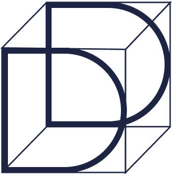

  <h1 align="center">DeliteAI</h1>
  
  <h2 align="center">On-Device AI platform for creating delightful experiences</h2>

  
  
  

DeliteAI is a powerful on-device AI platform for building agentic workflows that enables developers
to deliver secure, privacy-aware, and high-performance AI native experiences and applications
across multiple platforms and devices.

## Key Features

### Developer Productivity
- Unified and simplified APIs for seamless AI agents integration in Android/iOS applications
- Python interface for orchestrating complex AI agentic workflows via tool calling, memory and LLMs on-device
- Streamlined development process for both new and existing applications

### Portability & Small Form Factor
- Cross-platform compatibility across operating systems
- Support for various compute platforms and runtimes
- Abstracted development layer for the fragmented device landscape
- Optimized for resource-constrained environments with efficient CPU/memory usage

### Security & Privacy
- Privacy-first approach with on-device processing
- Hardware-accelerated model execution

### Extensibility
- Easy integration of custom Python operators
- Flexible runtime support (ONNX or ExecuTorch)

## Getting Started
To get started you can:
- Follow the steps in [coreruntime](coreruntime/README.md) to build and test the core C++ SDK with Python bindings
- Build and try out the [Android](sdks/android/README.md) and [iOS](sdks/ios/README.md) SDK and sample app
- Explore the available agents in the [agents](agents) directory.

Visit the [assistant](https://github.com/NimbleEdge/assistant) repo to see it
all in action.

## Documentation

[Coming Soon]

## Community engagement
We welcome any feedback or suggestions - please join our
[Discord](https://discord.gg/y8WkMncstk) to engage with the community.

## Contributing

We welcome contributions from the community! Whether you're interested in:
- Adding new Python operators
- Enhancing runtime support
- Improving documentation
- Reporting bugs or suggesting features

Please read our [Contributing Guidelines](CONTRIBUTING.md) to get started.

## License

This project is licensed under the Apache License 2.0 - see the [LICENSE](LICENSE) file for details.
